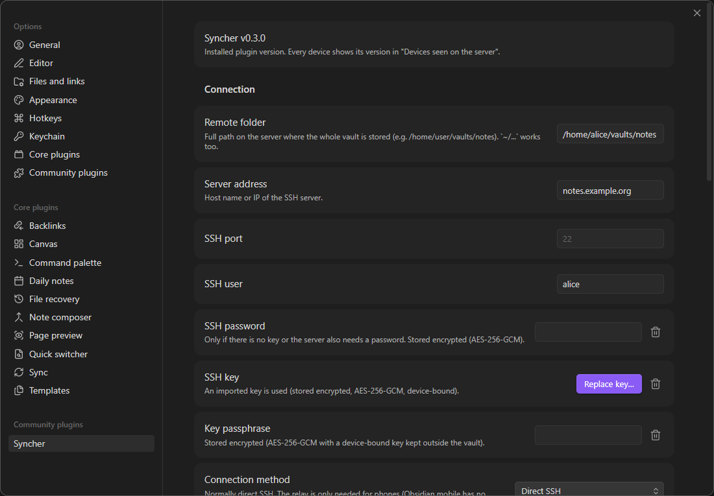
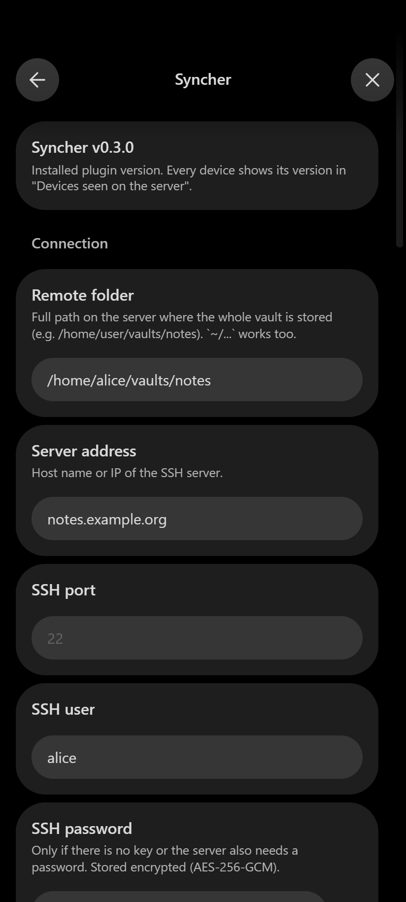
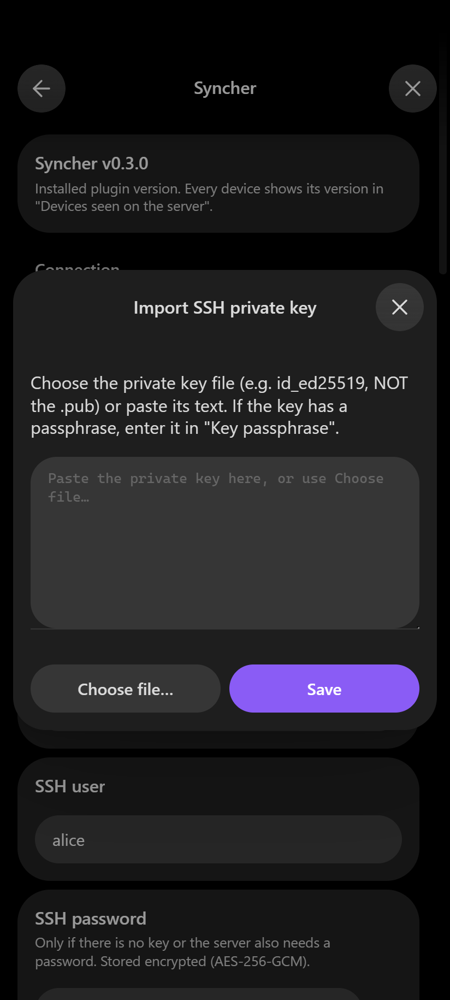
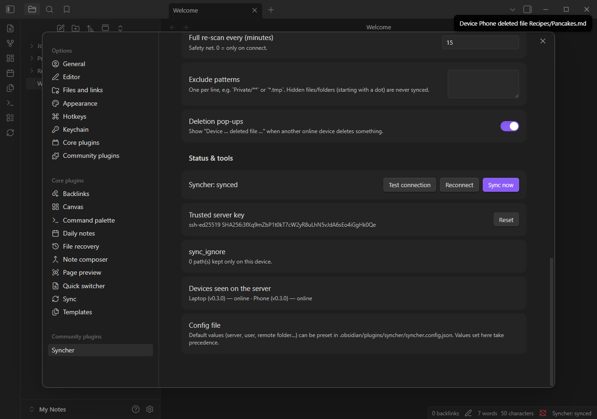

<div align="center">

# Syncher

**Live two-way sync of your Obsidian vault with a folder on your own server — over plain SSH.**
No cloud, no subscription, no third party: just your notes, your devices and your server.

[](https://github.com/tequrity/syncher/releases/latest)
[](https://github.com/tequrity/syncher/releases)
[](LICENSE)
[](https://obsidian.md)
[](#-installation)
[](#-security)

[Features](#-features) ·
[Screenshots](#-screenshots) ·
[How it works](#-how-it-works) ·
[Quick start](#-quick-start) ·
[Server setup](#%EF%B8%8F-step-1--prepare-the-server) ·
[Installation](#-installation) ·
[Settings](#-settings-reference) ·
[Disclosures](#-disclosures) ·
[Troubleshooting](#-troubleshooting) ·
[FAQ](#-faq)

</div>

---

## ✨ Features

- 🔄 **Live sync** — every change (even a single space) reaches the server a moment after you stop typing;
  your other open devices receive it within seconds.
- 💾 **Local _and_ remote copies** — work offline as long as you like, everything catches up on reconnect.
- 🔐 **Your own server, plain SSH/SFTP** — any Linux box, NAS, VPS or Raspberry Pi with OpenSSH will do.
- 📱 **Windows, Linux and Android** — the same plugin on every device.
- 🗑️ **Mirror deletions**, with a pop-up _"Device X deleted file Y"_ when another online device deletes something.
- ✍️ **Last writer wins** when two devices edit the same note; different notes can be edited at the same time.
- 🚚 **Renames and moves** are applied as renames (nothing is downloaded again).
- 🛡️ **Permanent save** — a per-device switch: "never delete anything here".
- 🧯 **Safety nets** — asks before a sync would delete many files, never lets one broken file stop the rest,
  pins the server key like `ssh` does, encrypts stored passwords and keys.

## 📸 Screenshots

<p align="center">
  
</p>
<p align="center">
  
  &nbsp;&nbsp;
  
</p>
<p align="center">
  
</p>

## 🧭 How it works

```
 [ laptop ] ──┐
              ├── SSH/SFTP ──►  [ your server: /path/to/vault ]  ◄── SSH (through a small relay) ── [ phone ]
 [ desktop ] ─┘
```

1. Every device keeps a small, private "hash base" (`.obsidian/plugins/syncher/state.json`) that remembers what
   each file looked like at the last sync. Comparing _then_ with _now_ on both sides tells exactly who changed what.
2. A changed file is uploaded right away and a line is added to a change journal on the server. Other online
   devices read that journal every few seconds and fetch only what changed.
3. When a device connects (and every 15 minutes, as a safety net) it does a full comparison of both sides.

Hidden files and folders (names starting with a dot, such as `.obsidian`, `.trash`, `.git`) are **never** synced:
every device keeps its own Obsidian settings.

> [!NOTE]
> **Why a relay for phones?** Obsidian on Android does not let plugins open network connections of their own, so a
> phone cannot talk SSH directly. The plugin sends the very same encrypted SSH stream through a WebSocket to a tiny
> relay next to your SSH server, and the relay just passes the bytes on. The relay never sees your data unencrypted,
> and the plugin still checks your server's key. Computers do not need the relay at all.

## 🚀 Quick start

| # | What | Where | Time |
|---|---|---|---|
| 1 | [Prepare the server](#%EF%B8%8F-step-1--prepare-the-server): a folder, an SSH key, (for phones) the relay | server | 5 min |
| 2 | [Install the plugin](#-installation) | each device | 2 min |
| 3 | [Fill in the settings](#%EF%B8%8F-step-3--configure-the-plugin) and press **Test connection** | each device | 2 min |

That's it — from then on it syncs by itself.

---

## 🖥️ Step 1 — Prepare the server

You need a computer that is always on and runs an **SSH server** (OpenSSH). A Linux server, a NAS, a VPS or a
Raspberry Pi are all fine. You must be able to log in to it with `ssh`.

### 1.1 Create a folder for the vault

Log in to the server and create an empty folder. One folder = one vault.

```bash
mkdir -p ~/vaults/notes
```

Write down the full path, you will need it later. To see it, run `cd ~/vaults/notes && pwd`
— it prints something like `/home/<your user>/vaults/notes`.

### 1.2 Create an SSH key (recommended)

A key is a file that lets the plugin log in without a password. Do this **on your computer**, not on the server.

<details>
<summary><b>🪟 Windows</b></summary>

1. Press <kbd>Win</kbd>, type **PowerShell**, press <kbd>Enter</kbd>.
2. Create the key (press <kbd>Enter</kbd> at every question; a passphrase is optional):
   ```powershell
   ssh-keygen -t ed25519 -f "$env:USERPROFILE\.ssh\syncher"
   ```
3. Put the public half on the server (replace `<user>` and `<server>`; you will be asked for your server password once):
   ```powershell
   type "$env:USERPROFILE\.ssh\syncher.pub" | ssh <user>@<server> "mkdir -p ~/.ssh && cat >> ~/.ssh/authorized_keys"
   ```
4. Check it: `ssh -i "$env:USERPROFILE\.ssh\syncher" <user>@<server>` must log you in without the server password.

</details>

<details>
<summary><b>🐧 Linux / macOS</b></summary>

```bash
ssh-keygen -t ed25519 -f ~/.ssh/syncher        # press Enter at every question
ssh-copy-id -i ~/.ssh/syncher.pub <user>@<server>
ssh -i ~/.ssh/syncher <user>@<server>           # must log in without the server password
```

</details>

You now have two files: `syncher` (**private** — never share it) and `syncher.pub` (public, already on the server).

> [!TIP]
> No key? The plugin can also log in with the server password, if your server allows password logins.

### 1.3 Install the relay (only if you use a phone)

Skip this if you only sync computers. On the server, from a copy of this repository:

```bash
git clone https://github.com/tequrity/syncher.git
cd syncher
sudo sh server/install-relay.sh
```

You should see `Syncher relay is running: ws://<this server>:8022 -> 127.0.0.1:22`.
The relay needs only Python 3 and systemd. If the script says a firewall is active, run the command it prints
to open port **8022** (or open it only to your home network / VPN).

<details>
<summary><b>Relay options, reinstall, update and removal</b></summary>

| Task | Command |
|---|---|
| Install (listens on 8022, forwards to the local SSH on port 22) | `sudo sh server/install-relay.sh` |
| SSH is on another port / use another relay port | `sudo sh server/install-relay.sh --port 8022 --target 127.0.0.1:2222` |
| Reinstall or update (after `git pull`, or to change options) | run the install command again |
| Remove completely (stops it, disables it, deletes its files) | `sudo sh server/install-relay.sh --uninstall` |
| Is it running? | `systemctl status syncher-relay` |
| Live log (shows each phone connecting) | `journalctl -u syncher-relay -f` |

If you opened port 8022 in a firewall, close it again after removal (for example `sudo ufw delete allow 8022/tcp`).

**Encrypted `wss://`** — recommended if the relay is reachable from the internet: start the relay with
`--cert fullchain.pem --key privkey.pem` (a certificate the phone trusts, e.g. Let's Encrypt — phones reject
self-signed ones) or put it behind Caddy/nginx with HTTPS, and enter `wss://…` as the relay address in the plugin.
An equivalent alternative to this relay is `websockify 8022 127.0.0.1:22`.

</details>

---

## 📦 Installation

Syncher is not in the Obsidian community store yet. Pick **one** of the two ways below.

### Option A — with BRAT (easiest, works on every device, updates itself)

1. Open Obsidian → **Settings** (⚙️ bottom left) → **Community plugins**.
2. If you see **Turn on community plugins**, press it.
3. Press **Browse**, search for **BRAT**, press **Install**, then **Enable**.
4. Go back to **Settings**, open **BRAT** in the left list (under _Community plugins_).
5. Press **Add beta plugin**, paste `tequrity/syncher`, press **Add plugin**.
6. In **Settings → Community plugins**, make sure the switch next to **Syncher** is on.

### Option B — by hand

1. Open the [latest release](https://github.com/tequrity/syncher/releases/latest) and download
   **`main.js`**, **`manifest.json`** and **`styles.css`**.
2. Find your vault folder (the folder you opened in Obsidian) and inside it the hidden folder `.obsidian/plugins`.
   Create a folder named **`syncher`** there and put the three files into it:
   ```
   <your vault>/.obsidian/plugins/syncher/main.js
   <your vault>/.obsidian/plugins/syncher/manifest.json
   <your vault>/.obsidian/plugins/syncher/styles.css
   ```
   <details>
   <summary>How to see hidden folders</summary>

   - **Windows:** File Explorer → **View** → **Show** → **Hidden items**.
   - **Linux:** in most file managers press <kbd>Ctrl</kbd>+<kbd>H</kbd>.
   - **Android:** copy the files over USB, or use a file manager app and turn on "show hidden files" in its menu.
     Vaults usually live in `Documents/<vault name>` in the internal storage.

   </details>
3. Restart Obsidian → **Settings → Community plugins** → **Turn on community plugins** (if asked) →
   press the refresh button ⟳ next to _Installed plugins_ → switch **Syncher** on.

<details>
<summary><b>From source</b> (developers)</summary>

```bash
git clone https://github.com/tequrity/syncher.git && cd syncher
npm install
npm run release                          # builds main.js and copies it to dist/syncher
node scripts/install.mjs "<path to your vault>"
```

</details>

---

## ⚙️ Step 3 — Configure the plugin

Open **Settings → Syncher** (at the bottom of the left list). At the very top you see
**Syncher v…** — the installed version.

### 🪟🐧 On a computer

1. **Remote folder** — the full path from [step 1.1](#11-create-a-folder-for-the-vault), e.g. `/home/<user>/vaults/notes`.
2. **Server address** — the name or IP of your server.
3. **SSH port** — leave empty for the usual `22`.
4. **SSH user** — your login on the server.
5. **SSH key** — press **Import key…** → **Choose file…** → pick your **private** key
   (`syncher`, _not_ `syncher.pub`; on Windows it is in `C:\Users\<you>\.ssh\`) → **Save**.
   The key is stored encrypted on this device; the plugin never reads files outside your vault.
   _The file picker hides the `.ssh` folder? Type `%USERPROFILE%\.ssh` (Windows) or `~/.ssh` (Linux) into its
   address bar, or paste the key text into the big field instead._
6. **Key passphrase** — only if you gave the key a passphrase.
7. **Connection method** — keep **Direct SSH**.
8. Press **Test connection**. You should see:
   _"Connection OK: `<user>` via `<server>:22`, folder … is writable."_
9. Close the settings window. The status bar at the bottom shows **Syncher: syncing…** and then
   **Syncher: synced**. Done!

### 📱 On an Android phone

1. Copy your **private** key file (`syncher`) to the phone (USB cable, a message to yourself, a cloud drive…).
2. Fill in **Remote folder**, **Server address** and **SSH user** exactly as on the computer
   (the **SSH port** is not used on the phone).
3. **SSH key** → **Import key…** → **Choose file…** → pick the key file you copied → **Save**.
   The key is now stored encrypted inside Obsidian — **delete the copied key file** from the phone's storage.
   _Can't find it in the picker? Open the key file on a computer in a text editor, copy all of its text, paste it
   into the big field of the import window and press **Save**._
4. **Key passphrase** — only if the key has one.
5. **WebSocket relay URL** — leave it **empty** if you installed the relay with the default settings
   (it then uses `ws://<server address>:8022`).
6. Press **Test connection** — you should see _"Connection OK: … via ws://…:8022, folder … is writable."_
7. Close the settings. Syncing starts on its own. The first sync of a big vault takes a few minutes; keep Obsidian open.

### ✅ Check that everything works

1. On one device create a note `Hello.md` and type something.
2. A few seconds later it appears on the other device.
3. Delete it on the other device → it disappears on the first one, which shows
   _"Device … deleted file Hello.md"_.

---

## 📖 Everyday use

- Just use Obsidian. The status is shown in the status bar (computer) and in the tooltip of the ⟳ icon in the
  left ribbon (phone). Hovering it also shows the plugin version.
- **Click the status bar or the ⟳ icon** to run a full sync now.
- Commands (<kbd>Ctrl</kbd>/<kbd>Cmd</kbd>+<kbd>P</kbd> → type _Syncher_): **Sync now (full scan)**,
  **Reconnect**, **Pause / resume auto-sync**.
- Files deleted by the sync go to the trash (system trash or `.trash`, as set in
  **Settings → Files and links → Deleted files**).
- If a sync is about to delete more than half of your files (for example the server folder was emptied or you
  pointed the plugin at another folder), it **asks first**. Answering **No, restore them (merge)** keeps everything.
- On a phone, Android cuts the connection when Obsidian goes to the background; the plugin reconnects and catches
  up as soon as you come back.

### What happens when…

| Situation | Result |
|---|---|
| You edit a note | Sent to the server a moment after you stop typing; other devices get it within seconds. |
| You create a note or folder | Appears on the server and on all devices. |
| You rename or move a note or folder | Renamed/moved everywhere (not downloaded again). |
| You delete a note or folder | Deleted on the server and on all devices — unless a device has **Permanent save** on. |
| Another online device deletes a note | Pop-up: _"Device ⟨name⟩ deleted file ⟨file⟩"_. No pop-up for changes made while you were offline. |
| Two devices edit the same note | **Last writer wins**: the later edit is kept. |
| One device edits a note another one deleted | The edit wins; the note comes back with the new content. |
| A device was offline | On reconnect both sides are compared and merged. |
| A file cannot be synced (e.g. a name Windows does not allow) | It is skipped and listed under **Not synced** in the settings; everything else keeps syncing. |

## 🛡️ Permanent save

**Permanent save** is a switch you set per device. It means: _"on this device the sync never deletes anything,
it only adds and updates."_

1. Another device deletes a file → here it **stays**. Its path goes to the `sync_ignore` list
   (`.obsidian/plugins/syncher/sync_ignore.json`, also shown in the settings), so it is not uploaded again and
   does not come back on the other devices.
2. A new file with the **same name** arrives from the server → the kept one is renamed
   `note.md` → `note-1.old.md` (then `-2.old`, `-3.old`, …) and stays in `sync_ignore`; the new file syncs normally.
3. New and changed files from the server still arrive here.
4. **Turning it off** clears `sync_ignore`, re-reads all files and uploads everything that was kept
   (including the `*.old` files) as new — so they reappear on all devices.

## 🧾 Settings reference

| Setting | What it does |
|---|---|
| **Remote folder** | Full path of the vault folder on the server (`~/…` works too). Created if missing. |
| **Server address** | Host name or IP of the SSH server. |
| **SSH port** | Default `22`. Not used on phones (they go through the relay). |
| **SSH user** | Login on the server. |
| **SSH password** | Only if there is no key or the server also asks for a password. Stored encrypted. |
| **SSH key → Import key…** | Imports your private key once (file picker or pasted text); stored encrypted on this device. |
| **Key passphrase** | If the key is protected with a passphrase. Stored encrypted. |
| **Connection method** | Computers: **Direct SSH** (normal) or **Through the relay** (to test the relay from a computer). |
| **WebSocket relay URL** | Shown when the relay is used. Empty = `ws://<server address>:8022`; or `wss://…`. |
| **Device name** | Shown to the other devices, e.g. in deletion pop-ups. Defaults to `Desktop-xxxx` / `Android-xxxx`; give it a friendly name like "Laptop". |
| **Permanent save** | See [above](#%EF%B8%8F-permanent-save). |
| **Auto-sync** | Connect on start and sync every change. |
| **Check server every (seconds)** | How often to look for changes made by other devices (default 3). |
| **Delay after typing (ms)** | How long to wait after the last keystroke before sending (default 800). |
| **Full re-scan every (minutes)** | Safety net for missed events (default 15; 0 = only on connect). |
| **Exclude patterns** | Paths not to sync, one per line, e.g. `Private/**` or `*.tmp`. |
| **Deletion pop-ups** | Turns the _"Device … deleted file …"_ pop-ups on or off. |
| **Test connection** | Checks everything a sync needs: connection, server key, login, SFTP, the remote folder and write access. |
| **Trusted server key** | The server key remembered on first connect. **Reset** only if the server was really reinstalled. |
| **Not synced** | Items that could not be synced and why (appears only when there are any). |
| **Devices seen on the server** | All devices with their plugin version and online state; ⚠ marks a device running another version. |

<details>
<summary><b>Config file</b> — preset values without typing</summary>

On first start the plugin creates `.obsidian/plugins/syncher/syncher.config.json`:

```json
{
	"remoteDir": "",
	"host": "",
	"port": 22,
	"username": "",
	"relayUrl": ""
}
```

- The fields are defaults; a value entered in the settings window always wins.
- The SSH key is not part of it: import it in the settings (it is stored encrypted, never as a plain file).
- The file belongs to one device and is never synced — handy for preparing a device in advance.

</details>

## 🔐 Security

- **SSH is built into the plugin** (pure TypeScript on top of the audited [`@noble`](https://paulmillr.com/noble/)
  crypto libraries), with modern algorithms only: curve25519 / ECDH key exchange, ed25519 / ECDSA / RSA-SHA2 keys,
  chacha20-poly1305 and AES-GCM/CTR ciphers, and "strict KEX" protection against the Terrapin attack.
- **The server key is pinned** on first connect. If it ever changes, the plugin refuses to connect and warns you.
- **Supported private keys:** OpenSSH format (ed25519, ECDSA, RSA — with or without a passphrase), PEM RSA and
  unencrypted PKCS#8. Convert PuTTY `.ppk` keys first (PuTTYgen → _Conversions → Export OpenSSH key_).
- **Passwords, passphrases and imported keys are encrypted** with AES-256-GCM. The encryption key is derived with
  HKDF-SHA-512 from a random 256-bit device key, with a fresh salt and nonce per secret. The device key lives in
  Obsidian's secret storage (or the app's local storage on older Obsidian versions) — **never** in the plugin's
  `data.json`, so a copied `data.json` is useless on another device.
- **The relay** only forwards encrypted SSH bytes. Prefer `wss://`, or allow port 8022 only from your network / VPN.
- Do not keep a private key in an ordinary (not hidden) folder of your vault: such files are synced to the server.

## 📢 Disclosures

As required by the Obsidian developer policies:

- **Network use:** the plugin connects **only** to the SSH server you enter in its settings (directly on a
  computer, or through the relay address you enter / `ws://<server address>:8022` on a phone). It sends your vault
  files there and nowhere else. No other server is ever contacted.
- **Files outside the vault:** none. The plugin reads and writes only your vault (through Obsidian's API) and its own
  settings folder. Your SSH key gets in only when you choose it in the **Import key…** window yourself.
- **System information:** none. The plugin does not read the computer's name, user name or environment; the default
  device name is `Desktop-xxxx` / `Android-xxxx` with a random suffix.
- **No account, no payment, no ads, no telemetry.** Nothing is collected or sent anywhere except your own server.
- **Open source:** all code is in this repository under the [MIT license](LICENSE).

## 🩺 Troubleshooting

| Message / symptom | What to do |
|---|---|
| _fill in server address, user and remote folder_ | Fill in those three fields (or the config file). |
| _SSH keys are no longer read from files on disk_ | You updated from an older version that used a key file: press **Import key…** once and pick the same key. |
| _the SSH key is encrypted_ / _wrong SSH key passphrase_ | Enter the (correct) passphrase in **Key passphrase**. |
| _this is not a usable SSH private key_ | You picked the `.pub` file or a PuTTY `.ppk`; pick the private OpenSSH key. |
| _authentication failed_ | Is the public key in `~/.ssh/authorized_keys` on the server? Is the user right? |
| _SERVER KEY CHANGED_ | If the server was really reinstalled, press **Reset** next to **Trusted server key**. Otherwise do **not** connect — something is wrong. |
| _relay … is not reachable_ (phone) | Is the relay running (`systemctl status syncher-relay`)? Is port 8022 open? Is the address right (empty = `ws://<server>:8022`)? Test from a computer: **Connection method → Through the relay** → **Test connection**. |
| _N item(s) could not be synced_ | Everything else is synced; see **Not synced** in the settings. Usual causes: a name with `* " \ < > : \| ?` (not allowed on Windows/Android — rename it on the device that created it), two files differing only in letter case (`Note.md` and `note.md` are one file on Windows/Android — rename one), a server folder without read permission. |
| A file does not appear on another device | Press **Sync now**. Hidden files (starting with a dot) and excluded patterns are not synced by design. |
| Another device shows ⚠ in **Devices seen on the server** | It runs another plugin version — update it and restart Obsidian there. |
| Anything else | Desktop: <kbd>Ctrl</kbd>+<kbd>Shift</kbd>+<kbd>I</kbd> → **Console** shows messages starting with `Syncher:`. |

## ❓ FAQ

<details>
<summary><b>Do I need the relay?</b></summary>

Only for phones. Computers connect to SSH directly.
</details>

<details>
<summary><b>Does it work on iPhone / iPad?</b></summary>

It is built the same way as on Android and should work through the relay, but it has not been tested on iOS yet.
</details>

<details>
<summary><b>Is my data stored anywhere else?</b></summary>

No. The only places are your devices and the folder on your server. The plugin keeps some bookkeeping in a hidden
`.syncher` folder inside the server folder (device heartbeats, a change journal, temporary upload files).
</details>

<details>
<summary><b>Can I sync several vaults?</b></summary>

Yes: use one server folder per vault and set the matching **Remote folder** in each vault.
</details>

<details>
<summary><b>Can I use it together with another sync tool on the same folder?</b></summary>

Please don't. Two sync tools on the same vault undo each other's deletions and fight over renames.
</details>

<details>
<summary><b>I used this plugin when it was called "Obsyncher"</b></summary>

The plugin was renamed to Syncher (the Obsidian directory does not allow names containing parts of "Obsidian").
Install Syncher next to it and enable it: on its first start it takes over the old settings, sync base and
encrypted passwords, disables the old copy (you can then delete it in **Settings → Community plugins**), and renames
the old `.obsyncher` metadata folder on the server. If you used a key **file**, press **Import key…** once.
A relay installed with the old script is replaced automatically when you run `sudo sh server/install-relay.sh` again.
</details>

<details>
<summary><b>How do I update?</b></summary>

BRAT updates the plugin automatically. By hand: replace the three files with the ones from the latest release and
restart Obsidian. The version shown at the top of the plugin settings tells you which one is running; see
[CHANGELOG.md](CHANGELOG.md) for what changed.
</details>

## 🛠️ Development

```bash
npm install
npm run build        # type-check + bundle main.js
npm run release      # build + copy to dist/syncher (checks that all version numbers match CHANGELOG.md)
npm test             # unit tests + integration tests against a real OpenSSH server (skipped when none is running)
npm run e2e          # end-to-end test inside a real Obsidian (set SYNCHER_OBSIDIAN to its executable)
```

- Integration tests use a throw-away user-mode sshd: `test/sshd/start-wsl-sshd.sh <keys dir> [port]`
  (`SYNCHER_TEST_SSH=host:port:user`, `SYNCHER_TEST_KEYS`, `SYNCHER_TEST_WS` for the relay test).
- Releases: bump the version in `manifest.json`, `package.json` and `versions.json`, add a `CHANGELOG.md` section,
  then push a tag equal to the version — GitHub Actions builds and publishes the release.

Project layout: `src/ssh` — SSH/SFTP client, `src/sync` — sync engine, `src/*.ts` — Obsidian plugin layer,
`server/` — relay and its installer, `test/` — tests, `docs/screenshots` — images used here.

## 📄 License

[MIT](LICENSE) © Mr.Racoon
